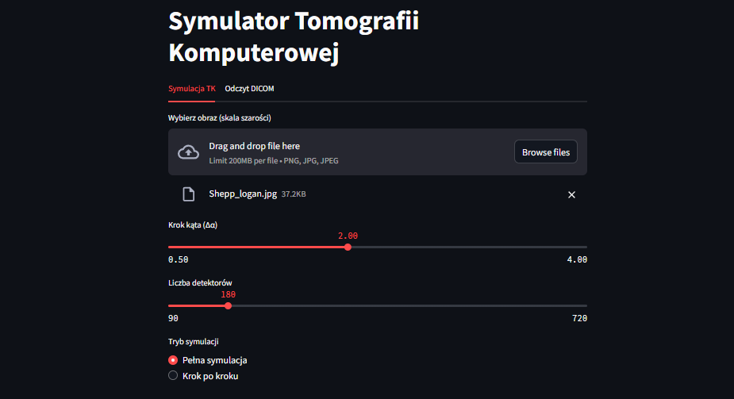
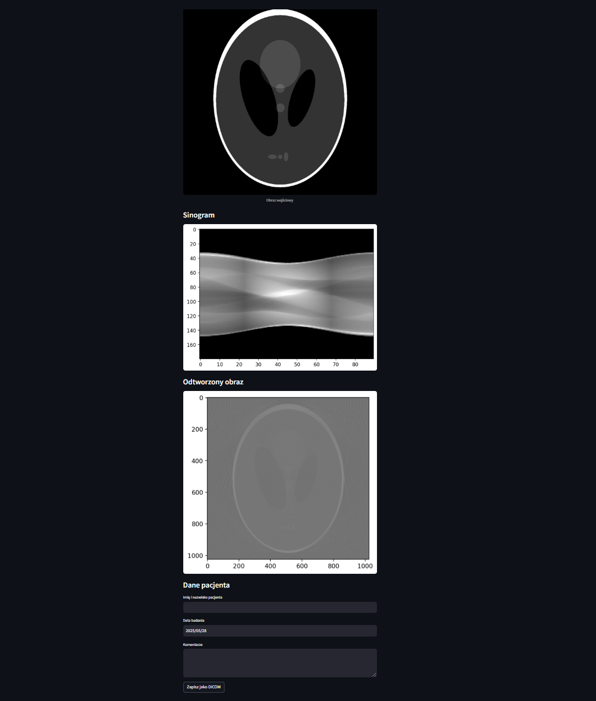

# Tomograf komputerowy – Symulator CT

Projekt z przedmiotu *Informatyka w Medycynie*, semestr 6.  
Repozytorium zawiera aplikację do symulacji działania tomografu komputerowego (CT), umożliwiającą testowanie rekonstrukcji obrazów oraz pracę z plikami DICOM.


## Spis treści

- [Opis projektu](#opis)
- [Struktura repozytorium](#Struktura-repozytorium)
- [Instrukcje użytkowania](#Instrukcje-użytkowania)
- [Wymagania](#Wymagania)
- [Urchomienie](#Uruchomienie)
- [Zrzuty ekranu](#zrzuty-ekranu)

---

## Opis projektu

Aplikacja pozwala na:
- symulację procesu tomografii komputerowej na podstawie obrazów testowych,
- rekonstrukcję obrazu z sinogramu,
- zapis wyników w formacie DICOM,
- odczyt i wyświetlanie plików DICOM.

W trakcie symulacji użytkownik może **dostosować kluczowe parametry tomografu**:
- **krok kąta (∆α)** – pozwala ustawić rozdzielczość kątową projekcji,
- **liczbę detektorów** – definiuje, ile detektorów rejestruje promienie podczas jednego obrotu


---

## Struktura repozytorium

- **ct_simulator.py** – główny plik aplikacji (Python, Streamlit)
- **tomograf_obrazy/** – przykładowe obrazy do testowania symulacji tomografu  
  Zaleca się korzystanie z tych obrazów podczas testów, ale można także używać własnych plików.
- **tomograf_dicom/** – przykładowe pliki DICOM oraz folder do zapisywania własnych wyników w tym formacie

---

## Instrukcja użytkowania

1. **Testowanie symulacji**
   - Uruchom aplikację (np. przez `streamlit run ct_simulator.py`).
   - W zakładce **Symulacja TK** załaduj obraz z folderu `tomograf_obrazy` lub własny obraz w skali szarości.
   - Skonfiguruj parametry symulacji (liczba detektorów, krok kąta, rozpiętość wachlarza).
   - Przeprowadź rekonstrukcję obrazu z sinogramu.

2. **Praca z plikami DICOM**
   - Możesz zapisać zrekonstruowany obraz jako plik DICOM (dane pacjenta można wpisać ręcznie).
   - Odczyt plików DICOM możliwy jest w zakładce **Odczyt DICOM** – możesz użyć przykładowych plików z folderu `tomograf_dicom` lub własnych.

3. **Własne testy**
   - Możesz używać własnych obrazów do symulacji i zapisywać własne pliki DICOM w folderze `tomograf_dicom`.

---

## Wymagania

- Python 3.x
- Streamlit
- numpy, matplotlib, scikit-image, pydicom, scipy

**Instalacja zależności:**


```bash
pip install streamlit numpy matplotlib scikit-image pydicom scipy
```


---

## Uruchomienie

W katalogu z plikiem `ct_simulator.py` uruchom:
```bash
streamlit run ct_simulator.py
```

## Zrzuty ekranu




